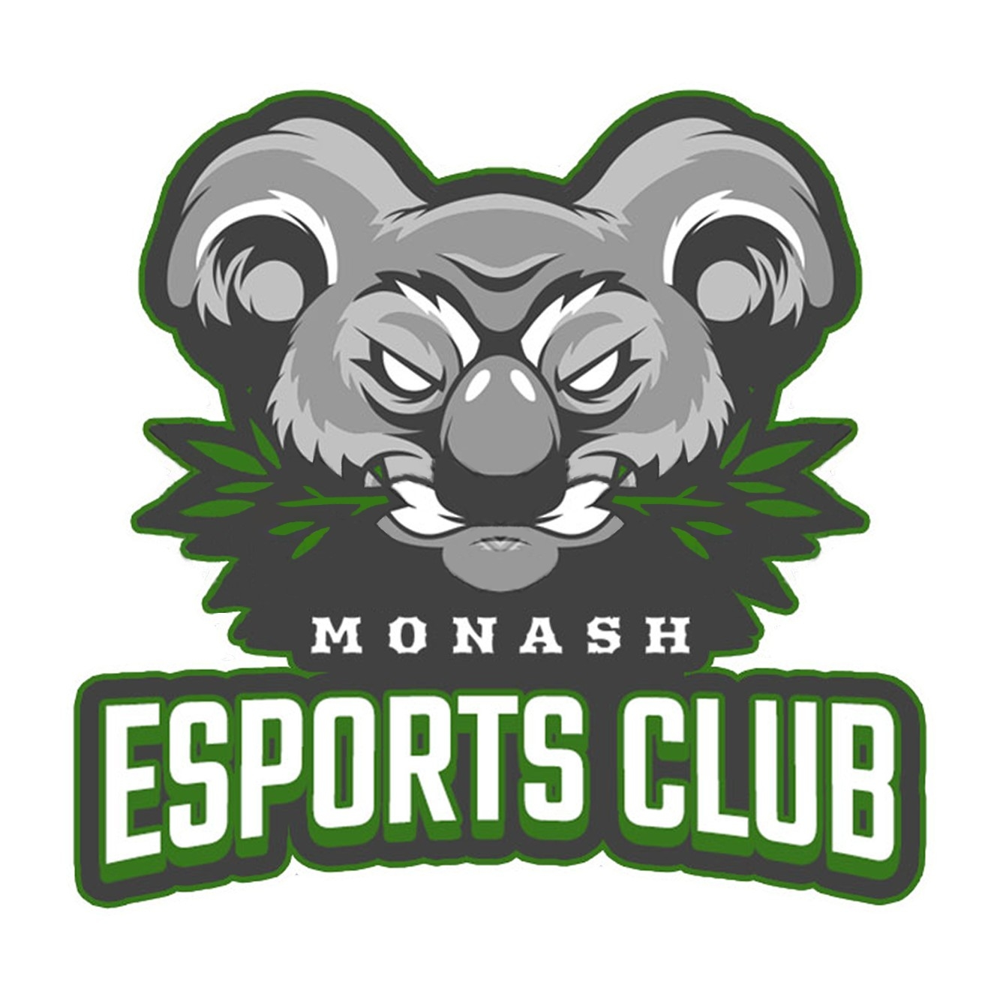

# Baby Koala

Discord Bot for Monash Esports Club

## Components

- **Discord** - The discord.js module for interacting with Discord's official API. Additionally, it uses the guild members fetch function to retrieve all the currently registered members.
- **MongoDB** - To persist settings, users and user points data, this bot uses a NoSQL database, MongoDB, to be able to synchronize data.
- **node-cron** - This library allows for easy scheduling with cron expression. The schedule is retrieved from the `Settings` table in MongoDB.

## Commands

- **/leaderboard** - View game leaderboard
  - *game*: The name of the game to display
- **/user** - View your records
  - *game*: The name of the game to display
